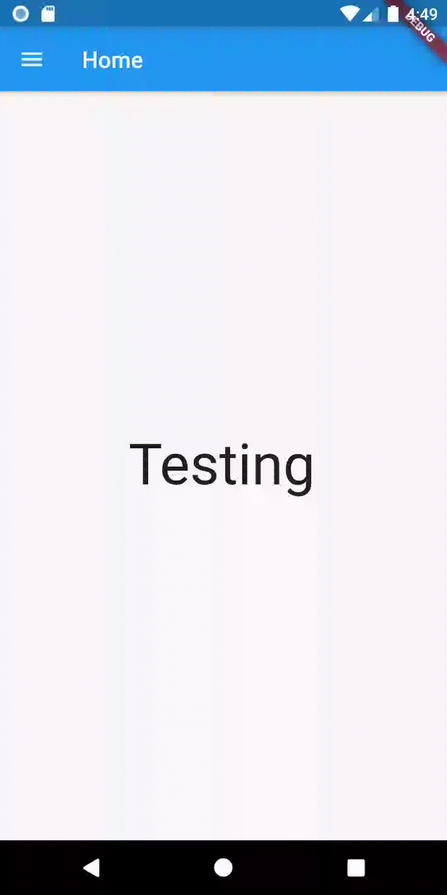

# Bible Bowl Companion
> A BAYDA Bible Bowl study companion.

## Table of Contents
* [General Info](#general-info)
* [Screenshots](#screenshots)
* [Technologies](#technologies)
* [Setup](#setup)
* [Features](#features)
* [Status](#status)
* [Contact](#contact)

## General Info
This project was started to create an alternate study experience to Quizlet for BAYDA Bible Bowl.

## Sample Screens
 

## Technologies
* Flutter
* Dart
* Android Studio

## Setup
Install [app-release.apk](build/app/outputs/apk/release/app-release.apk) to a device or build it from the source code.

## Features
Current features:

To-do list:
* Finish UI

## Status
_Currently in progress_

## Contact
Created by [Warkah Scott](https://www.linkedin.com/in/warkahscott/) - feel free to contact me!